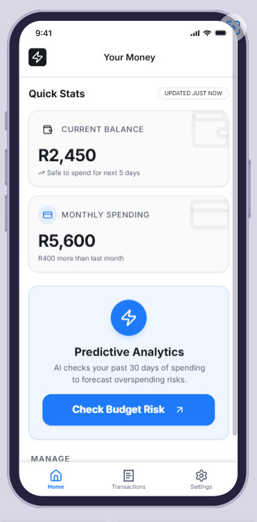
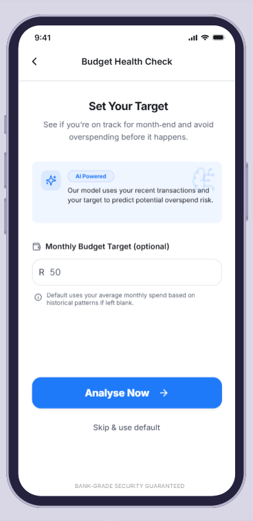
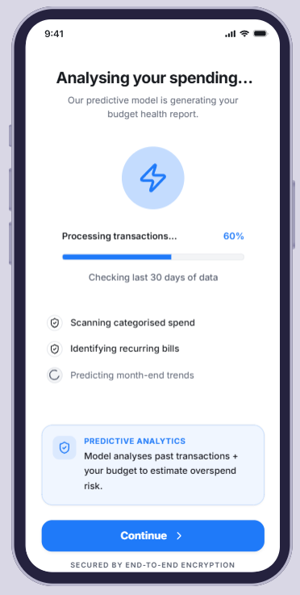
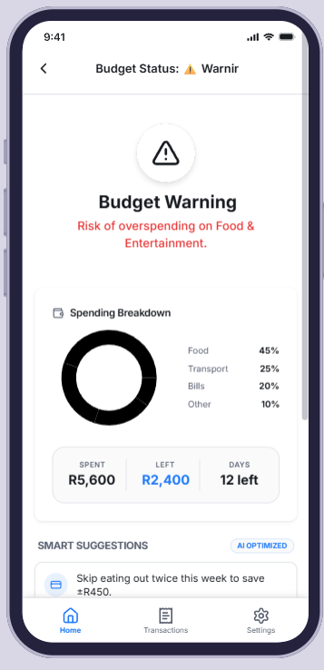
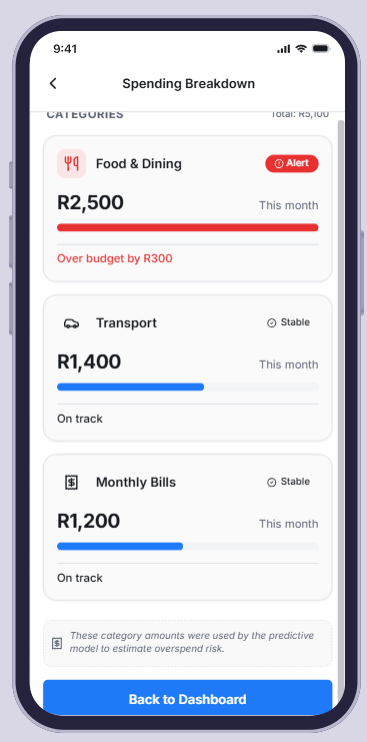

# Overspending-Alert-System

# FinTrack AI Dashboard

An AI-powered overspending alert system designed to provide predictive financial insights, transaction monitoring, analytics, and personalized user experiences through a modern mobile-first interface.

---
## Overview

This project is a modern fintech dashboard prototype originally designed in Visily and rebuilt as a production-ready frontend application using v0 by Vercel.

The application focuses on:

- Financial analytics
- Predictive spending insights
- Transaction management
- User account monitoring
- AI-driven recommendations
- Mobile-first UX design

---

## Features

### Dashboard Analytics
- Financial overview cards
- Spending summaries
- Income tracking
- Monthly performance metrics

### AI Insights
- Predictive expense analysis
- Smart budgeting recommendations
- Trend detection
- Personalized financial insights

### Transaction Management
- Recent transaction history
- Category filtering
- Search functionality
- Real-time balance updates

### User Experience
- Clean fintech UI
- Mobile-first responsive design
- Fast navigation
- Minimal modern interface

---

## Tech Stack

### Frontend
- React
- Next.js
- Tailwind CSS
- TypeScript

### Backend (Planned)
- Supabase / Firebase
- PostgreSQL
- Authentication
- API integrations

### Deployment
- Vercel

---

## Project Structure

```bash
fintrack-dashboard/
│
├── public/
├── src/
│   ├── components/
│   ├── pages/
│   ├── layouts/
│   ├── hooks/
│   ├── services/
│   ├── utils/
│   └── styles/
│
├── package.json
├── tailwind.config.js
├── tsconfig.json
└── README.md
```

---

## Screenshots

### Dashboard Overview


### Spending Analysis


### Transaction Details


### AI Insights & Recommendations


### Account Settings


---

## Getting Started

Open [http://localhost:3000](https://v0-overspending-alert-system.vercel.app/) with your browser to see the result.

---

## Roadmap

### Phase 1
- [x] UI/UX Prototype
- [ ] Frontend Development
- [ ] Responsive Optimization

### Phase 2
- [ ] Authentication
- [ ] Database Integration
- [ ] Transaction APIs
- [ ] AI Recommendation Engine

### Phase 3
- [ ] Notifications
- [ ] Dark Mode
- [ ] Export Reports
- [ ] Multi-account Support

---

## Future Improvements

- Open banking API integration
- AI financial assistant
- Voice-enabled analytics
- Investment portfolio tracking
- Fraud detection alerts

---

## Authors

Developed by techGURUS

GitHub: https://github.com/sanae16
